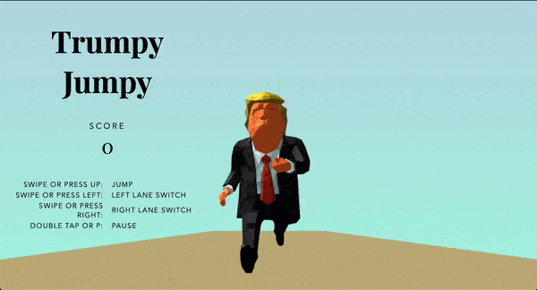

# Trumpy Jumpy

👋🏼Hey! Welcome to this repository first I would like to mention that this repo was not created for politics purposes, it is just a combination of experiments and good resources I found on the web. That being said have fun with this! Also make sure you check out the game here. [Trumpy Jumpy](https://trumpyjumpy.netlify.com/)

## How to build 
    npm install
    npm run build

## Resources
* [Three Js](https://github.com/mrdoob/three.js/)
* [Parcel](https://github.com/parcel-bundler/parcel)
* [HammerJs](https://github.com/hammerjs/hammer.js)
* [Trump Model](https://denysalmaral.com/2016/11/free-lowpoly-donald-trump-3d-character.html) created by Denys Almaral check out his [website](https://www.denysalmaral.com)! 
* [Game Template](https://github.com/wanfungchui/Boxy-Run)
